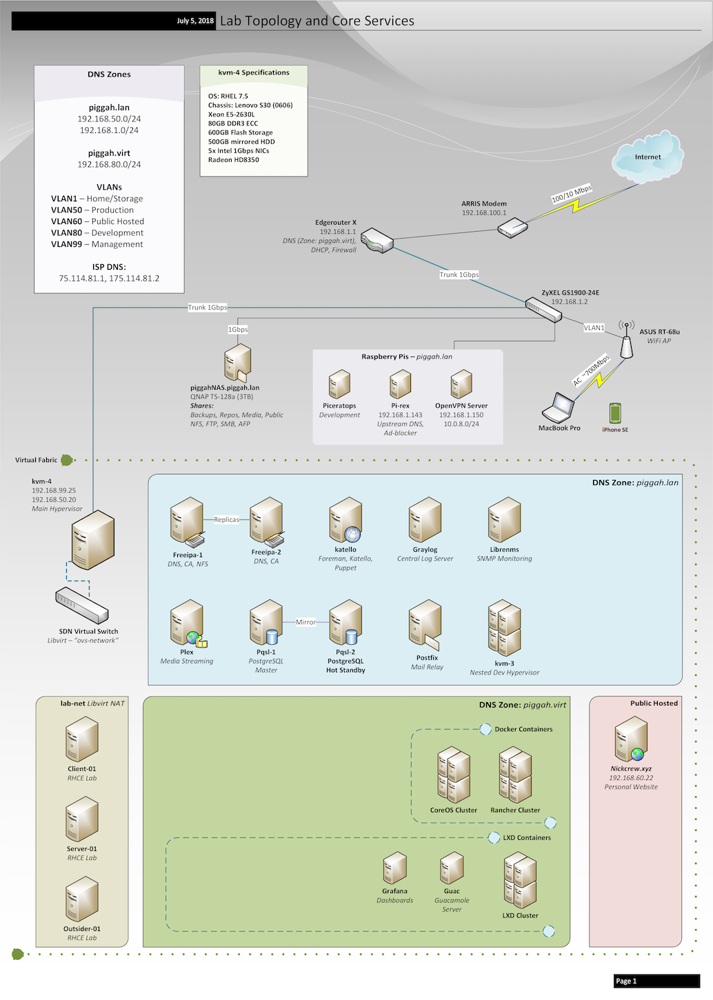

Title: My Home Lab
Category: Articles
Tag: Lab, Virtualization
Slug: homelab

# Synopsis
I love having some enterprise-grade gear in my home to try new software and work on projects with the goal of providing business value to my employers and advancing my career through an always-improving, current skillset. Also it's great fun for me and I really enjoy the challenge and satisfaction of new problems to solve every day. Without further ado, the details of my lab:     
# Hardware Resources

---

## Main Hypervisor: Lenovo S30 Chassis (Sandy Bridge)

* __CPU:__ Xeon E5-2630L  *2GHz 6core/12thread*
* __RAM:__ 80GB DDR3 ECC
* __Flash Storage:__ 600GB
* __HDD Storage:__ 500GB Mirrored LVM
* __Video:__ Radeon HD 8350
* __Network:__ 5x Intel 1Gbps NICs  
* __OS:__ Red Hat Enterprise Linux 7.5   
* __Virtualization Stack:__ qemu-kvm-rhev, libvirt, OpenVSwitch

This is a Sandy Bridge model S30, supporting up to a single Xeon E5-2690 processor and 128-256GB RAM depending on the type of memory used. (The Lenovo D30 is the dual-cpu variant.) Thanks to full Vt-d support, I am able to run nested hypervisors within this host. The socket 2011 boards and chips, starting with Sandy Bridge and Ivy Bridge, are a great balance between cost, power consumption and performance for use at home. Socket 1366 is getting a bit old for someone without ample space, cooling and electricity.   

### Secondary/Testing Hypervisor:

Dell Inspiron (slim) w/ Intel i5-2405S (4c/4t), 8GB DDR3, 120GB Flash Storage, 2 Gigabit NICs

---
## __Network Storage:__
*QNAP TS-128A* ...... __Capacity:__ 2TB w/ 1TB external backup  
 
Primarily a file and backup server (NFS and Samba), also provides: NTP (time syncronization), TFTP (PXE Boot), AFP (Apple Time Machine Backup), HTTP and FTP repositories and web pages, DLNA (Media Streaming)     

__Future Plans:__ A custom, low-power CentOS box with ZFS backed storage.  

## __Routing:__
*Ubiquity Edgerouter-X*   
 
The Edgemax line from Ubiquity uses an OS based off of Vyatta (VyOS). It provides a nice web ui with additional functionality available through the command line interface. The ER-X is small with an unbeatable price of $50. It supports hardware offloading for deep packet inspection, bridged interfaces, VLANs and IPsec. Inter-vlan speeds are 1Gbps (total for both directions It supports hardware offloading for deep packet inspection, bridged interfaces, VLANs and IPsec. Inter-vlan speeds are 1Gbps (total for both directions). This works for me since so much of my traffic stays within my hypervisor.  
 
__Future Plans:__ Virtualized or small-footprint device running VyOS, a Linux firewall and routing operating system. I have an increasing interest in software-defined networking and see a future where all of my networking infrastructure is virualized once I can guarantee a bit more redundancy.

## __Switching:__
*ZyXEL GS-1900-24E* .......  (24-Port Layer 2)  
 
This device has been fairly reliable, with one instance of an erased configuration after a hard reboot. Unfortunately, you cannot download a current-state config file for recovery purposes. It is also webUI-only. That said, it was reasonably priced and supports VLANs and LACP, the two most important things to me.  
 
__Future Plans:__ A virtualized or small-footprint device running OpenVSwitch. Could likely be ran on the same machine as the VyOS instance. OpenVSwitch is very powerful switching software that many enterprise-grade whitebox solutions are built with. I find that I learn a great deal more about networking when configuring a switch using these tools.

### __WiFi AP:__
*ASUS RT-68u*  
 
I bought this router to replace my ISP provided modem/router when I first started dreaming of expanded capabilities in my home. It will run DD-WRT if you want more advanced functionality and does support static routes only through the stock firmware (which is what I use). After upgrading my network to be VLAN-capable, the RT-68u was switched into Access Point Mode, in which it performs admirably. I typically see AC speeds of 6-700Mbps on my local network. No plans to replace it. If I need to cover more area in the future I will most likely switch to Ubiquity APs.   

### __Workstation:__
 *2017 MacBook Pro nTB 13"* ...... 16GB RAM, dual-core intel i5  
 
First, I never thought I could use a laptop smaller than 15" and this machine has totally converted me to the 13" life. The primary reason I chose a MBP rather than, say, a Dell XPS or Lenovo Carbon, is the hugely important factor of a Unix-based operating system and the software available for the platform. Had I chosen any other manufacturer, I would be running desktop Linux (KDE Plasma is my preferred environment) and in doing so be required to virtualize Windows to run certain applications required for my college classes. macOS let's me run any desktop application I might need without giving up my Unix OS. The most important macOS app for me is iTerm2. Homebrew gives me access to any Linux programs I have need of.

### __3x Raspberry Pis:__  

* __Pihole:__ a very effective, customizable, network-wide adblocker using DNS blacklists. It runs dnsmasq, so you can optionally use it as a DHCP server. Provides nice graphs and statistics for ads blocked on your network.
* __OpenVPN Server:__ I run my VPN server on one of the Pis currently. A project called PiVPN is available that allows an easy-install similar to pihole for those interested in a quick set-up. My VPN server is hugely important to me. First, it allows me secure access to my network while I'm away from home and also allows me to securely use public internet. I may move it to a dedicated VM for better performance. Tip: Run your VPN server on a port like 443 incase the foreign networks you connect to block 1194.  
* __Pi #3:__ Currently without a job, just used for various testing scenarios. Perhaps I will move into the public-hosted VLAN or host my documentation on it.
 

Diagrams
----

### Physical and Virtual Networks
  
[View Larger](../images/network.png)  

  

### Core Servers Organization, DNS Zones and Physical Layout  

[View Larger](../images/services.png)

#### Core Services Summary
---

* __OpenVSwitch:__  
Software-Defined Networking powerhouse, allows for complex
virtual networking setups. I have replaced Linux bridges with OVS and increased network functionality with the change. One benefit of using OVS is hosts on the same subnet do not 'leave' the OVS network, allowing fast communication at virtio speeds (up to 15Gbps).

* __The Foreman, Katello and Puppet:__  
Unattended installs, provisioning and life cycle management. This was a major project to get operational but it was well worth it. All of the standard processes involved in creating new machines is automated and it's an absolute joy once you get it going. [Read more about my use of The Foreman here.](/blog/life-and-death-of-a-vm/)

* __LibreNMS:__  
SNMP-based monitoring solution, collects a huge amount of data if desired and sends alerts to my phone. Allows me to discover historical patterns in all of my machines, including VMs. I plan to feed LibreNMS data into InfluxDB in order to generate some Grafana dashboards in the near-future. I also use __Netdata__ for real-time monitoring. It's very easy to set-up and I would recommend it for beginners looking to get a view into their system health.

* __Graylog:__  
Centralized log aggregation, extraction and dashboard display. Graylog has the benefit of being easy to deploy. I use a combination of Rsyslog and the Graylog Sidecar Collector to collect more specific logs. In the future I will revisit the ELK stack and Splunk.  

* __FreeIPA:__  
FreeIPA is also known as by Red Hat as Identity Management, but it does much more than that and has become a critical part of my lab. I have two FreeIPA replicas (critical means redundancy!) that handle DNS, Single Sign-On, Automounting, Kerberos and authentication for my lab. It adds a ton of convenience and I also am enjoying learning about all of its components.

* __Rancher:__  
Rancher is my container orchestration tool I'm currently using. Very powerful and easy to use Web UI. It will manage many services across many hosts and enable you to create high-availability applications.

* __LXD:__  
I love LXD containers. Most of my VMs are Red Hat but I always have a couple Ubuntu VMs to act as LXD hosts. LXD Containers behave much closer to full-fledged VMs in practice compared to Docker and are really great for both quick experimenting and long-term hosts. They require significantly less resources than a full VM while still providing most of the benefits. I have LXD containers based off several different OS images including Ubuntu, CentOS, Alpine and Fedora. You can create clusters, overlay networks across multiple physical machines, take snapshots and live migrate your LXD containers. LXD can use ZFS, Btrfs or regular directories to back the container file systems. Personally, I am using Btrfs and installing the host VM directly to LVM volumes. This allows for near native disk performance. Very cool technology I would recommend especially to beginners.

* __Plex:__  
My central source for Movies, Music and TV Shows! My QNAP mentioned earlier stores all of my media and the Plex server mounts it as an NFS share. I primarily use Plex to watch movies and TV shows. My (extensive) music library is loaded into my Plex library but I typically choose to play my music through iTunes. Plex is free and offers a fantastic UI and organization. It will transcode virtually any format, though I try to avoid the need for on-the-fly transcode due to the CPU load. You can share your Plex library with friends and family as if you were your own mini-Netflix service.

And there you have it. The basics of my home lab, a place I spend a great deal of time and will hopefully be writing many more blog about in the future! I am currently a bit space and power-consumption constrained so most of my expansion from this point will be into AWS resources, which I will document all the same. I eagerly await the day I can install a 24U+ server rack at home, but for now the Lenovo is serving admirably, I plan smartly to maximize resources and AWS credits are plentiful for students!  
